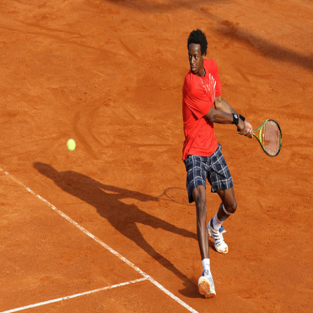
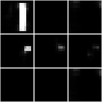
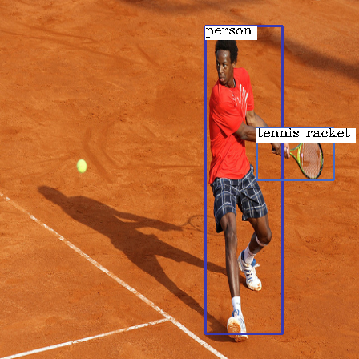
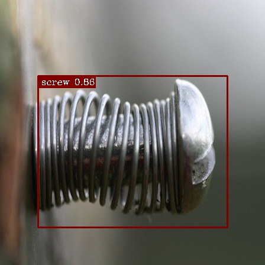
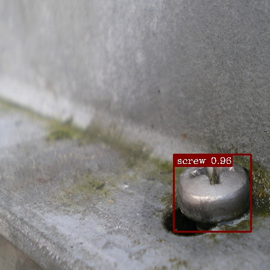
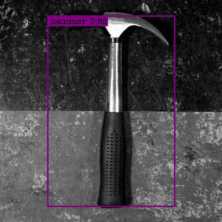
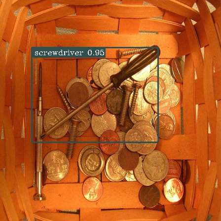
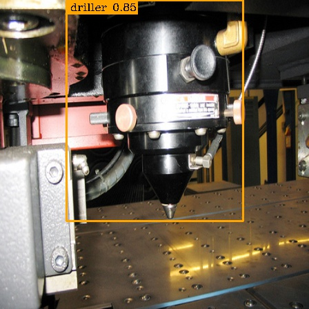
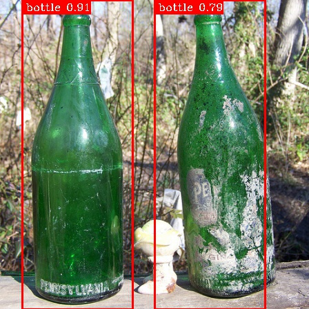
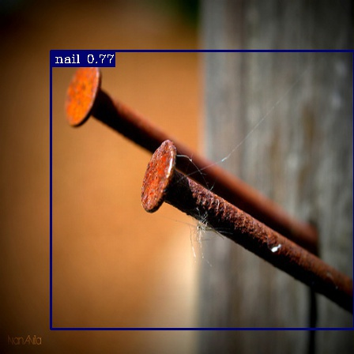

### Description
This is a TensorFlow implementation of simple yet powerful object detector, 
based on autoencoder architecture. It is fully convolutional which makes it really fast.

### How does it work?
The network takes the images of constant size w = h = 448 (it is not crucial to
resize images to the same size, nevertheless it was empirically tested as yielding best 
results). The network is trained to convert input images into
S × S × C tensor of probabilities, where S stands for the size of output tensor and C is the number of classes in the dataset.
Each cell in this tensor denotes probability that there is a part of some object within this cell.
The first two coordinates denotes spatial probability and ensures translation invariance, whereas
third parameter corresponds to class of object. 

Simple example: assuming S = 14 and C = 80 (as in COCO dataset) and the original object was 
of class no. 53 and occupies entire upper left part of image, then the network should produce tensor T,
where T[0:7, 0:7, 52] (52 because zero indexing, you know) is filled with ones. When there are other 
classes as well as overlapping object, there should be naturally more ones within that tensor.

The next step is to sift out too small probabilities (here 0.3 threshold was used). After that I applied
standard OpenCV findContours and boundingRect algorithms to find bounding boxes. This process is class independent - 
it is processed on each slice (according to last dimension) of the output tensor independently. 
Too small contours are rejected as false positives. If the objects of 
single class are too crowded, the bounding boxing algorithm treats them as
single objects - that's a flaw I am working on. 

One picture is worth a thousand words, so let's see this process on images.

1. Original image.

2. Some of slices (masks) from generated tensor of probabilities. Note that thresholding has not yet been applied.

3. Nonzero masks after thresholding (the second mask is rejected in later part of pipeline, because its area is too small)

4. Final image with bounding boxes.

### Requirements
Used libraries (versions are provided only for informational purpose - the code should
run with no harm on reasonable younger/older versions)
- tensorflow 1.4.1
- numpy 1.14.1
- opencv 3.3.0

### Running steps
1. 
    Create folder named 'data'. In order to get anything done, you first need to downloaded COCO data from here: http://cocodataset.org/#download . Download:
    - 2017 Train images (wget http://images.cocodataset.org/zips/train2017.zip)
    - 2017 Val images (wget http://images.cocodataset.org/zips/val2017.zip)
    - 2017 Train/Val annotations (wget http://images.cocodataset.org/annotations/annotations_trainval2017.zip)
    
    Extract these 3 files and put their content into previously created 'data' folder. Your project tree should look like this (most folders not shown for brewity):
    - data
        - annotations
        - train2017
        - val2017
    
    End of step 1:) Remove downloaded zipped files if you don't need them anymore.

2. COCO Object Detection Dataset contains over 100k images with annotated
    objects belonging to 80 classes. The network outputs tensor of shape SxSxC. S states for an
    arbitrary size. You could provide independent datasets for different architectures.
    To create dataset, run prepare.py with parameters:
    - dst_w (width of generated labels)
    - dst_h (height of generated labels)
    - annotations_path (path to FILE with annotations - that's the one with JSON extension)
    - labels_path (path to folder, where labels should be placed - it will be created automatically if not present yet)
    
    YOU SHOULD GENERATE TRAIN AND VALIDATION SETS INDEPENDENTLY! Don't do anything with test data, because there are no annotations for this data.
    Generally I used S = dst_w = dst_h. In case of generating training data, be prepared to very long wait - it tooks 5 hours on my laptop.
    
    Example of usage:
    - python prepare.py --dst_w=14 --dst_h=14 --annotations_path=data/annotations/instances_val2017.json --labels_path=data/labels_S14
    
    
### Some results

